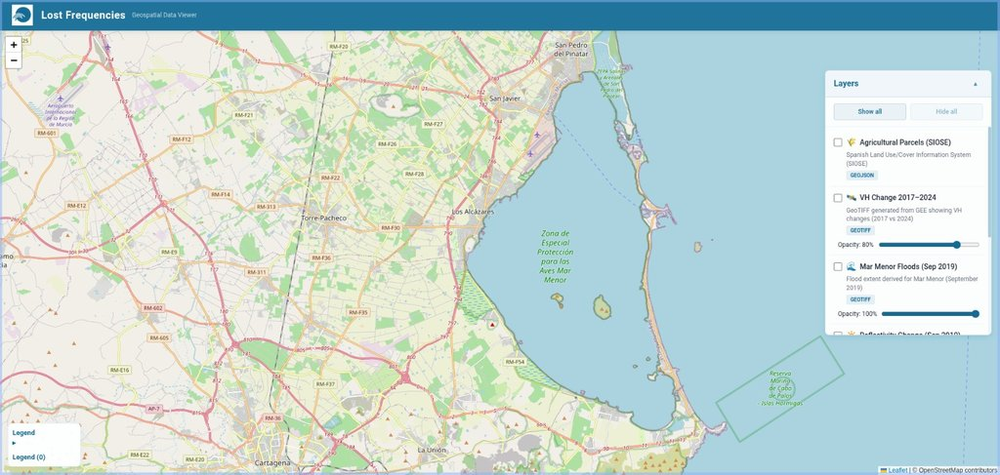
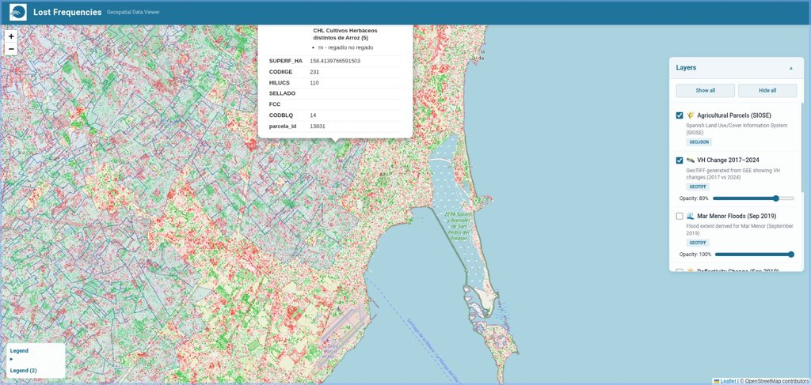
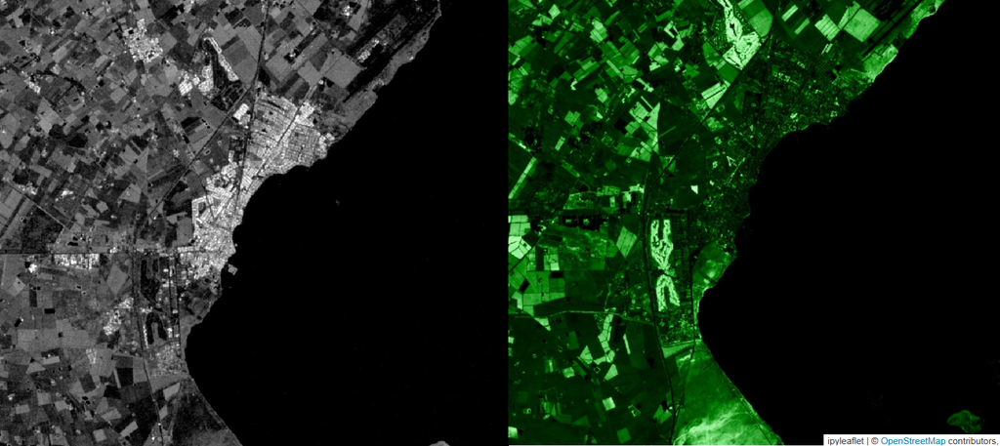
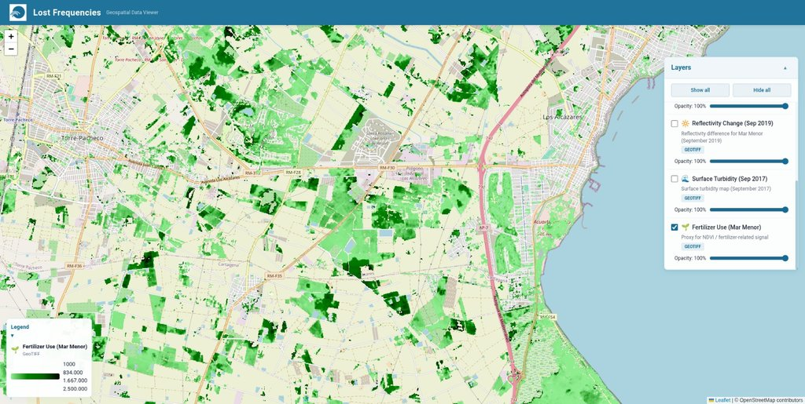
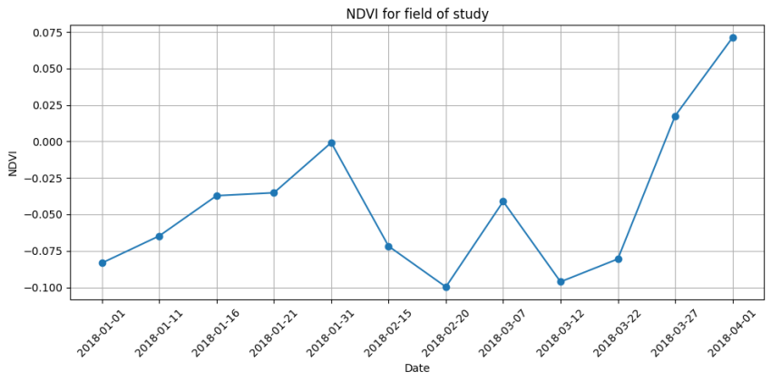
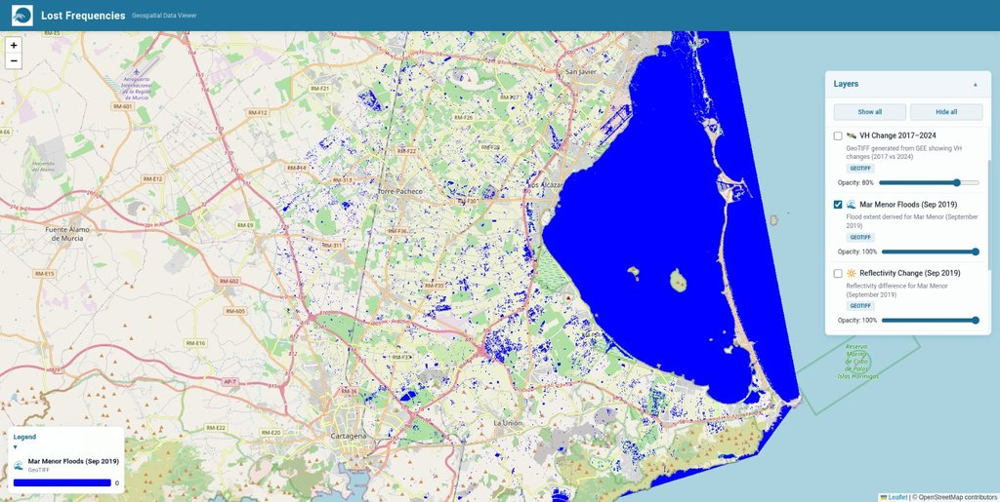

# Lost Frequencies — Satellite-powered insights for the Mar Menor

*Interactive viewer showing multiple environmental layers across the Mar Menor.*

An open, multilayer geospatial project that turns satellite data into actionable insights to identify pollution sources around the Mar Menor (Murcia, Spain). We built a fast, client-side viewer that overlays preprocessed GeoTIFF and GeoJSON layers for unauthorized agriculture, fertilizer use, sediment flow, flood extent, and more.

— Local Winner Project · NASA Space Apps Challenge Murcia 2025 —

## Summary

Lost Frequencies harnesses satellite imagery to expose and explain environmental pressures on the Mar Menor. We transform complex datasets into clear, trusted layers that help administrations and authorities act faster and smarter.

- What you get: an interactive multilayer viewer + ready-to-run notebooks and outputs
- What it shows: unauthorized fields, fertilizer application, sediment transport, flood extent, vegetation/biomass/moisture change
- Why it matters: lower monitoring costs, faster response, and scalable insights for other regions

## Context: the Mar Menor, our childhood by the sea

The Mar Menor is a unique coastal lagoon in southeastern Spain, long loved for its calm waters and biodiversity. In recent years it has suffered intense degradation from agriculture and extreme floods. Multiple hypoxia events (oxygen collapse) have caused mass die-offs, and fertilizer runoff has at times made waters unsafe for bathing. Lost Frequencies seeks to support decision-making with up-to-date, spatially explicit evidence.

## What we built

*Interactive viewer showing multiple environmental layers across the Mar Menor.*

Provide pollution insights to motivate decision-making:

- A performant, interactive web viewer to explore multiple satellite-derived layers at once
- A Python processing pipeline that generates GeoTIFF/GeoJSON layers from Sentinel-1 and Sentinel-2
- Clear methodology per layer so results are interpretable and reproducible

All map layers used by the MVP are included/documented, and the viewer runs 100% locally.

## How it works (data and methods)

*Satellite ingestion → band math & composites → export GeoTIFF/GeoJSON.*

All satellite processing is implemented in Python. Each layer is produced by combining bands and time periods relevant to the target indicator, and exported as GeoTIFF (rasters) and/or GeoJSON (vectors) to feed the viewer.

- NDVI (Sentinel‑2): (B8 − B4) / (B8 + B4), where B8 is NIR and B4 is red
- Fertilizer use: NDVI variance per pixel over ~20‑day windows; high positive variance flags sudden vegetation change consistent with fertilizer application
- Sediment flow: median composites before/after events; water pixels detected by thresholding; reflectance change highlights sediment‑rich zones
- Agricultural land‑use change (Sentinel‑1): VH band difference between two periods to produce a dB change image; mask water pixels where VH < −22 dB to avoid water‑driven differences
- Flood extent (SAR): compare event backscatter with a dry reference; floodwaters appear as low backscatter (dark) due to specular reflection, delineating temporary inundation paths

Planned layers (roadmap):

- Floating algae (e.g., Floating Algae Index, FAI)
- Nutrients proxies (nitrates/phosphates) via vegetation–water reflectance patterns
- Turbidity, soil moisture, flood‑prone indices, and other environmental indicators

## Repo structure at a glance

- `visor/` — React + Leaflet viewer (MVP), all client‑side, powered by Vite and TailwindCSS
	- `public/capas/` — place GeoTIFF/GeoJSON layers here for the viewer
- `S1_Agricultural_Change_MarMenor_TS.ipynb` — Sentinel‑1 VH change (dB) between periods
- `S1_Inundacion_DANA2019_MarMenor.ipynb` — Sentinel‑1 flood extent mapping for the DANA 2019 event
- `S2_NDVI_Variation_MarMenor.ipynb` — Sentinel‑2 NDVI computation and variance analysis

## Notebooks overview (inputs → outputs)

All notebooks are designed to be reproducible and to emit viewer‑ready assets (GeoTIFF/GeoJSON). Result paths can be configured inside each notebook.

1) `S2_NDVI_Variation_MarMenor.ipynb`

- Computes NDVI from Sentinel‑2 (B8, B4), builds time stacks, and calculates per‑pixel variance in ~20‑day windows
- Flags fertilizer‑like pulses where variance exceeds a positive threshold
- Outputs: NDVI composites and NDVI variance GeoTIFFs; optional GeoJSON masks for high‑variance areas

2) `S1_Agricultural_Change_MarMenor_TS.ipynb`

- Loads Sentinel‑1 VH time periods, computes dB differences (period2 − period1)
- Highlights vegetation/biomass/moisture changes over agricultural lands
- Masks water where VH < −22 dB
- Outputs: dB change GeoTIFF and optional vector summaries

3) `S1_Inundacion_DANA2019_MarMenor.ipynb`

- Compares SAR backscatter during the DANA 2019 flood vs a dry reference
- Detects floodwaters via low backscatter thresholds and morphological cleaning
- Outputs: flood extent GeoTIFF (and optional GeoJSON contours)

Note: The project uses local, preprocessed assets in the MVP due to hackathon constraints. The methods and thresholds are documented within each notebook to facilitate reuse.

## Intended impact

Local impact (Murcia, 2025): The Regional Government allocated €1.25M for weekly in‑situ monitoring. Lost Frequencies complements these efforts by cutting time and economic costs with scalable satellite monitoring, enabling earlier interventions and better targeting. It also reduces the load on laboratory resources (reagents, HPLC/spectrophotometers), reserving them for confirmatory analyses.

Global impact: While born for the Mar Menor, this approach generalizes worldwide—from Mississippi/Atchafalaya plumes in the US to Villarrica in Chile and lake systems near Fuxian in China. Benefits scale: improved monitoring, lower costs, faster response to ecological change.

## Roadmap

- Add algae (FAI) and nutrient proxy layers
- Add turbidity/soil moisture indices and flood‑prone maps
- Automate a minimal API to stream tiles (optional)—keeping the viewer static‑host‑friendly
- Package processing code into a small Python module with CLI entrypoints

## License and attribution

This project was created for the NASA Space Apps Challenge 2025. Base maps © OpenStreetMap contributors. Satellite data courtesy of the Copernicus programme (Sentinel‑1/2).

## Acknowledgements

Thanks to the local community and environmental groups working tirelessly to protect the Mar Menor.
